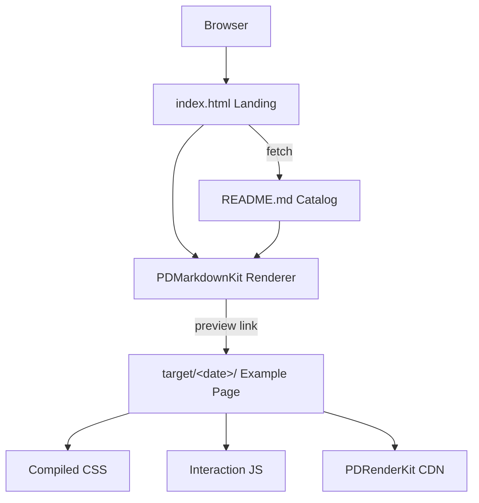

> [!NOTE]
> This README was generated by [SKILL](https://github.com/agenvoy/skill-readme-generate), get the ZH version from [here](./doc/README.zh.md).

***

<strong>38 HANDCRAFTED FRONTEND PAGES, ZERO BUILD STEP!</strong>

***

> A static HTML frontend showcase with 38 standalone pages, modular SCSS sources, and real-world PDRenderKit usage

## Table of Contents

- [Features](#features)
- [Architecture](#architecture)
- [License](#license)
- [Author](#author)

## Features

> [Live Demo](https://pardnio.github.io/demo-web/)

- **38 Standalone Examples** — Each example lives in its own date-named folder, covering blog, portfolio, restaurant, gym, and app landing layouts that open independently.
- **Modular SCSS Sources** — Styles split into header, section, and footer partials, with compiled CSS kept alongside the original SCSS for side-by-side study.
- **PDRenderKit Proving Ground** — 29 examples load the in-house PDRenderKit (formerly PDExtension) framework from CDN, tracing its evolution from 1.0.0 to 1.5.2.
- **Markdown-Driven Landing Page** — The landing page renders this README with PDMarkdownKit at runtime, so adding an example only requires editing the README.
- **Zero-Build Deployment** — The entire site is static files served by GitHub Pages straight from the root of `main`.

## Architecture

## License

This project is licensed under the [MIT LICENSE](LICENSE).

## Author

Just [open an issue](https://github.com/pardnio/demo-web/issues/new) to share an idea.

***

©️ 2024 [邱敬幃 Pardn Chiu](https://www.linkedin.com/in/pardnchiu)
