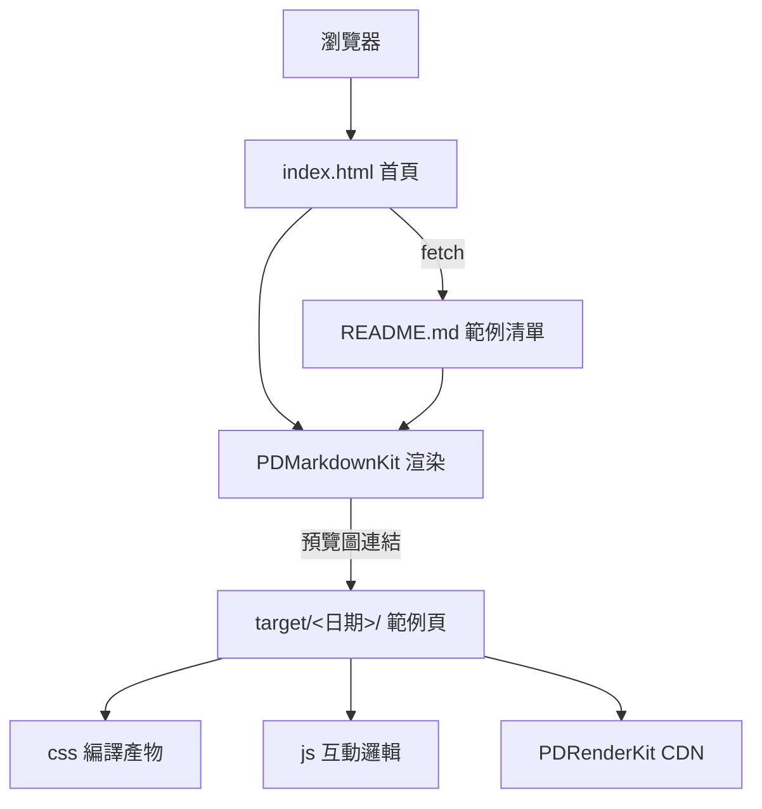

> [!NOTE]
> 此 README 由 [SKILL](https://github.com/agenvoy/skill-readme-generate) 生成，英文版請參閱 [這裡](../README.md)。

***

<strong>38 HANDCRAFTED FRONTEND PAGES, ZERO BUILD STEP!</strong>

***

> 純靜態 HTML 前端範例合輯，具備 38 個獨立頁面、SCSS 模組化原始碼與 PDRenderKit 實戰應用

## 目錄

- [功能特點](#功能特點)
- [架構](#架構)
- [授權](#授權)
- [Author](#author)

## 功能特點

> [線上瀏覽](https://pardnio.github.io/demo-web/)

- **38 個獨立範例** — 每個範例自成一個以日期命名的資料夾，涵蓋部落格、作品集、餐廳、健身房、App 介紹等版型，可單獨開啟。
- **SCSS 模組化原始碼** — 樣式以 header／section／footer 等 partial 拆分，編譯後的 CSS 與原始 SCSS 一併保留供對照學習。
- **PDRenderKit 實戰場** — 29 個範例透過 CDN 引入自家 PDRenderKit（原 PDExtension）框架，記錄框架從 1.0.0 到 1.5.2 的演進。
- **Markdown 驅動的首頁** — 首頁以 PDMarkdownKit 即時渲染 README，新增範例只需編輯 README。
- **免建置部署** — 全站為純靜態檔，直接由 GitHub Pages 從 `main` 分支根目錄發佈。

## 架構

## 授權

本專案採用 [MIT LICENSE](../LICENSE)。

## Author

Just [open an issue](https://github.com/pardnio/demo-web/issues/new) to share an idea.

***

©️ 2024 [邱敬幃 Pardn Chiu](https://www.linkedin.com/in/pardnchiu)
